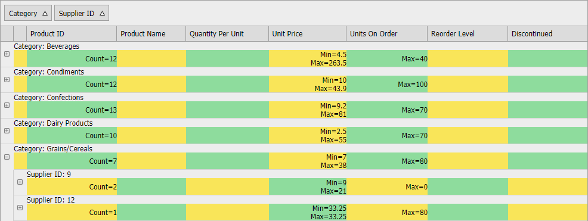

<!-- default badges list -->

[](https://supportcenter.devexpress.com/ticket/details/T446118)
[](https://docs.devexpress.com/GeneralInformation/403183)
<!-- default badges end -->

# Grid View for ASP.NET MVC - How to display group summary in group headers

[GridView](https://docs.devexpress.com/AspNetMvc/8966/components/grid-view) supports group footer summaries out of the box. It may be necessary to display group summaries in column headers separately for every group. This example demonstrates one of the possible solutions.



To implement group header summaries, create the group row content template and call the [SetGroupRowContentTemplateContent](https://docs.devexpress.com/AspNetMvc/DevExpress.Web.Mvc.GridViewSettings.SetGroupRowContentTemplateContent.overloads) method to assign the template to the grid.

```csharp
settings.SetGroupRowContentTemplateContent(c => {
    GridGroupRowContentTemplate.Container = c;
    ViewContext.Writer.Write(GridGroupRowContentTemplate.GetTemplateHtml());
});
```

The template consists of two parts: a custom group title and group summaries.

```cs
public static void CreateGroupRowTable() {
    MainTable = new Table();
    GroupTextRow = CreateRow();
    SummaryTextRow = CreateRow();
    CreateGroupTextCell();
    CreateIndentCells();
    foreach (var column in VisibleColumns)
        CreateSummaryTextCell(column);
    ApplyStyles();
}
```

The `CreateGroupTextCell` method creates the title.

The `CreateSummaryTextCell` method creates cells for the summary. The number of cells is equal to the total column count. Grid creates additional indent cells before columns when the data is grouped. When data is grouped by several columns, the total indent count is different in different group rows (deeper child groups have fewer indents. The deepest child has no indent). In this example, the `CreateIndentCells` method generates the correct number of indents depending on the group level.

## Adjust summary cell width on the client

The client `AdjustSummaryTable` method sets the width of summary cells in the following cases:
* Grid is initialized.
* Grid is resized.
* Grid sends a callback.
* A browser window is resized.
  
```js  
function AdjustSummaryTable() {  
    RemoveCustomStyleElement();  
    var styleRules = [ ];  
    var headerRow = GetGridHeaderRow(grid);  
    var headerCells = headerRow.getElementsByClassName("gridHeader");  
    var totalWidth = 0;  
    for(var i = 0; i < headerCells.length; i++)  
        styleRules.push(CreateStyleRule(headerCells[i], i));  
    AppendStyleToHeader(styleRules);  
}  
```  

## CSS resources

This solution contains several static CSS rules (see the [Styles.css](./CS/Sample/Content/Styles.css) file). Use the following rules to set the cell background colors or just remove them to get the default background color.  

```css
.summaryTable tr:last-child td:nth-of-type(even) {
    background: #8EDC9D;
}
.summaryTable tr:last-child td:nth-of-type(odd) {
    background: #F9E559;
}
```

## How to integrate this solution to a real project
  

1. Include **GridGroupRowContentTemplate.cs**, **Scripts.js**, and **Styles.css** files in your project.  
2. Call the [SetGroupRowContentTemplateContent](https://docs.devexpress.com/AspNetMvc/DevExpress.Web.Mvc.GridViewSettings.SetGroupRowContentTemplateContent.overloads) method to assign the `GridGroupRowContentTemplate` to the grid group row content template:  
  
    ```cs  
    settings.SetGroupRowContentTemplateContent(c => {
        GridGroupRowContentTemplate.Container = c;
        ViewContext.Writer.Write(GridGroupRowContentTemplate.GetTemplateHtml());
    });
    ```  
  
    ```vb  
    Protected Sub Grid_Init(ByVal sender As Object, ByVal e As EventArgs)  
        Grid.Templates.GroupRowContent = New GridGroupRowContentTemplate()  
    End Sub  
    ```  
  
3. Add script and CSS files in your web page:  
  
    ```aspx  
    <link href="~/Content/Styles.css" rel="stylesheet" type="text/css" />
    <script type="text/javascript" src="~/Content/Scripts.js" />
    ```  
  


## Files to Review

* [GridGroupRowContentTemplate.cs](./CS/Sample/Controllers/GridGroupRowContentTemplate.cs) (VB: [GridGroupRowContentTemplate.vb](./VB/Sample_VB/Controllers/GridGroupRowContentTemplate.vb))
* [Scripts.js](./CS/Sample/Content/Scripts.js) (VB: [Scripts.js](./VB/Sample_VB/Content/Scripts.js))
* [Styles.css](./CS/Sample/Content/Styles.css) (VB: [Styles.css](./VB/Sample_VB/Content/Styles.css))
* [HomeController.cs](./CS/Sample/Controllers/HomeController.cs) (VB: [HomeController.vb](./VB/Sample_VB/Controllers/HomeController.vb))
* [NorthwindDataModel.cs](./CS/Sample/Models/NorthwindDataModel.cs) (VB: [NorthwindDataModel.vb](./VB/Sample_VB/Models/NorthwindDataModel.vb))
* [GridViewPartial.cshtml](./CS/Sample/Views/Home/GridViewPartial.cshtml) (VB: [GridViewPartial.vbhtml](./VB/Sample_VB/Views/Home/GridViewPartial.vbhtml))
* [Index.cshtml](./CS/Sample/Views/Home/Index.cshtml) (VB: [Index.vbhtml](./VB/Sample_VB/Views/Home/Index.vbhtml))

## Documentation

* [Group Summary](https://docs.devexpress.com/AspNet/3758/components/grid-view/concepts/use-data-summaries/group-summary)


## More Examples

* [Grid View for ASP.NET Web Forms - How to display group summary in group headers](https://github.com/DevExpress-Examples/asp-net-web-forms-grid-display-group-summary-in-group-headers)  
